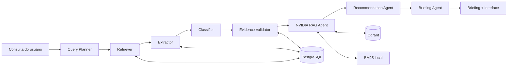

<p align="center">
  
</p>

<h1 align="center">NVIDIA Startup AI Radar</h1>

<p align="center">
  Inteligência de ecossistema para identificar startups brasileiras e recomendar tecnologias NVIDIA com evidências rastreáveis.
</p>

<p align="center">
  
  
  
  
  
</p>

<p align="center">
  <a href="#visão-geral">Visão geral</a> ·
  <a href="#arquitetura">Arquitetura</a> ·
  <a href="#comece-em-5-minutos">Como executar</a> ·
  <a href="#decisões-técnicas">Decisões técnicas</a>
</p>

---

## Visão geral

O **NVIDIA Startup AI Radar** transforma uma pergunta em linguagem natural em um briefing acionável para o time de Startups & VCs. O sistema localiza startups em uma base curada, avalia seu uso de IA, valida cada evidência e recomenda tecnologias NVIDIA aderentes ao contexto de negócio.

O resultado não é apenas uma lista de recomendações: cada conclusão pode ser rastreada até as fontes armazenadas na base.

| O desafio | Como o Radar responde |
|---|---|
| Encontrar startups relevantes em uma base pré-populada | Query Planner + Retriever tolerante no PostgreSQL |
| Distinguir uso real de IA de marketing superficial | Extractor + classificação AI-native / AI-enabled / non-AI |
| Evitar citações inventadas | Validador híbrido de URL e semântica |
| Indicar a tecnologia NVIDIA certa | RAG híbrido: vetorial + BM25 + RRF + reranking |
| Entregar informação acionável | Briefing executivo e exportação em Markdown |

### Destaques

- **8 nós LangGraph** com responsabilidades bem delimitadas.
- **RAG híbrido** com embeddings Cohere, BM25, Reciprocal Rank Fusion e Cohere Rerank.
- **Rastreabilidade**: evidências são conferidas contra os documentos reais de cada startup.
- **Resiliência**: NVIDIA NIM como LLM principal e fallback automático para Groq em falhas recuperáveis.
- **Interface Streamlit** com classificação, transparência das evidências e download do relatório.

---

## Arquitetura



### Fluxo multiagente

| # | Nó | Responsabilidade |
|---:|---|---|
| 1 | `Query Planner` | Converte a pergunta em setor, categoria de IA e palavras-chave usando o vocabulário real do banco. |
| 2 | `Retriever` | Busca candidatas no PostgreSQL com condições tolerantes em `OR`. |
| 3 | `Extractor` | Estrutura tecnologias, uso de IA e trechos de evidência a partir dos documentos. |
| 4 | `Classifier` | Classifica a maturidade como AI-native, AI-enabled ou non-AI. |
| 5 | `Evidence Validator` | Valida URL e pertinência semântica de cada evidência. |
| 6 | `NVIDIA RAG Agent` | Recupera tecnologias NVIDIA a partir do perfil validado da startup. |
| 7 | `Recommendation Agent` | Produz recomendação técnica e de negócio, com prioridade, complexidade e próxima ação. |
| 8 | `Briefing Agent` | Consolida o resultado em Markdown sem nova chamada de LLM. |

### RAG híbrido

O RAG consulta uma base de 21 chunks sobre tecnologias NVIDIA. A busca combina sinais complementares antes do reranking:

```text
Perfil validado da startup
        │
        ├── Embedding Cohere ──► Qdrant (busca vetorial)
        └── Tokenização ───────► BM25 (busca lexical)
                                      │
                         Reciprocal Rank Fusion
                                      │
                          Cohere Rerank v3.5
                                      │
                    Tecnologias NVIDIA candidatas
```

Essa composição reduz o risco de perder resultados por diferença de vocabulário: a busca vetorial captura significado, enquanto a lexical reforça termos explícitos de domínio.

---

## Stack

| Camada | Tecnologia |
|---|---|
| Orquestração | LangGraph |
| LLM principal | NVIDIA NIM — `nvidia/nemotron-3-super-120b-a12b` |
| Fallback de LLM | Groq — `openai/gpt-oss-120b` |
| Banco relacional | PostgreSQL 16 via Docker |
| Banco vetorial | Qdrant via Docker |
| Embeddings | Cohere `embed-multilingual-v3.0` |
| Reranking | Cohere `rerank-v3.5` |
| Busca lexical | BM25 (`rank-bm25`) |
| Interface | Streamlit |

---

## Comece em 5 minutos

### 1. Pré-requisitos

- Python 3.12
- Docker Desktop em execução
- Chaves de API NVIDIA, Groq e Cohere

### 2. Clone e configure o ambiente

```powershell
cd CaseIA
python -m venv venv
.\venv\Scripts\Activate.ps1
pip install -r requirements.txt
```

### 3. Configure as variáveis de ambiente

Crie um arquivo `.env` na raiz do projeto. Ele não é versionado.

```dotenv
POSTGRES_USER=radar_user
POSTGRES_PASSWORD=caseia2026
POSTGRES_DB=startup_radar
POSTGRES_HOST=localhost
POSTGRES_PORT=5432

QDRANT_HOST=localhost
QDRANT_PORT=6333

NVIDIA_API_KEY=nvapi-...
GROQ_API_KEY=...
COHERE_API_KEY=...
```

### 4. Suba e prepare os bancos

```powershell
docker compose up -d

# Aplica o schema no PostgreSQL
Get-Content db/schema.sql | docker exec -i radar_postgres psql -U radar_user -d startup_radar

# Carrega startups e documentos
python -m scripts.populate_database

# Cria a coleção e indexa a base NVIDIA no Qdrant
python -m scripts.ingest_knowledge
```

> A indexação usa a API de embeddings da Cohere. Execute-a somente quando precisar reconstruir a coleção no Qdrant.

### 5. Abra a interface

```powershell
streamlit run app.py
```

Exemplos de consulta:

```text
Quero startups de saúde que usam IA de forma intensiva
Quais startups jurídicas podem se beneficiar de IA generativa?
Busco startups que fazem atendimento por voz
```

### Smoke test opcional

```powershell
python -m scripts.smoke_test
```

Esse comando executa o grafo completo e, portanto, consome chamadas de LLM e APIs de RAG.

---

## Estrutura do projeto

```text
CaseIA/
├── agents/                    # Somente os oito nós especializados
│   ├── query_planner.py
│   ├── retriever.py
│   ├── extractor.py
│   ├── classifier.py
│   ├── evidence_validator.py
│   ├── rag_agent.py
│   ├── recommendation.py
│   └── briefing_agent.py
├── core/                      # Estado e montagem do grafo
│   ├── state.py
│   └── graph.py
├── infrastructure/            # Integrações externas
│   ├── llm_client.py
│   └── postgres_repository.py
├── rag/                       # Busca híbrida e reranking
│   ├── embeddings.py
│   ├── bm25_search.py
│   └── rerank.py
├── scripts/                   # Comandos operacionais
│   ├── populate_database.py
│   ├── ingest_knowledge.py
│   └── smoke_test.py
├── data/                      # Sementes versionadas
├── db/schema.sql
├── assets/radar-mark.svg
├── app.py
├── docker-compose.yml
└── requirements.txt
```

---

## Interface e transparência

A interface Streamlit apresenta, por startup:

- classificação e nível de confiança;
- justificativa da classificação;
- quantidade de evidências válidas;
- evidências rejeitadas por URL inválida ou falta de sustentação semântica;
- briefing final e exportação em `.md`.

Também exibe quantas chamadas foram atendidas pelo NVIDIA NIM e quantas utilizaram o fallback Groq. Isso torna explícita a estratégia de resiliência durante uma demonstração.

---

## Decisões técnicas

### NVIDIA NIM com fallback controlado

O NVIDIA NIM é o motor principal dos agentes, alinhando a implementação à proposta do projeto. Erros recuperáveis de indisponibilidade, timeout ou limite de taxa acionam tentativas com backoff e, por fim, o fallback Groq. O fallback é uma medida de continuidade, não uma substituição silenciosa: a interface informa o motor utilizado.

### Evidência antes de recomendação

O validador aplica duas camadas:

1. **Determinística:** a URL citada pelo LLM precisa existir entre os documentos daquela startup no PostgreSQL.
2. **Semântica:** o LLM verifica se o trecho suporta ao menos uma parte relevante da afirmação feita sobre a empresa.

Somente o perfil validado segue para o RAG e para o agente de recomendação.

### RRF antes do reranking

BM25 e vetor não são intercambiáveis. O Reciprocal Rank Fusion combina as posições de ambos sem exigir que seus scores tenham a mesma escala; o reranker então ordena os melhores candidatos em contexto.

---

## Limitações conhecidas

- A base contém **18 startups** e 54 documentos curados manualmente; é menor que o intervalo recomendado de 30–80 registros.
- Não há scraping ou enriquecimento em tempo real. A base é propositalmente pré-populada para preservar rastreabilidade e escopo.
- O uso do NVIDIA NIM, Groq e Cohere depende das respectivas credenciais, disponibilidade e limites de taxa.
- A execução do grafo chama serviços externos; para revisar apenas a interface ou o código, não é necessário disparar uma busca.

---

<p align="center">
  Desenvolvido para o processo seletivo <strong>Inteli Academy · Liga de IA · NVIDIA</strong>.
</p>
